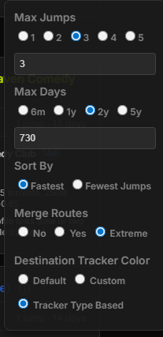
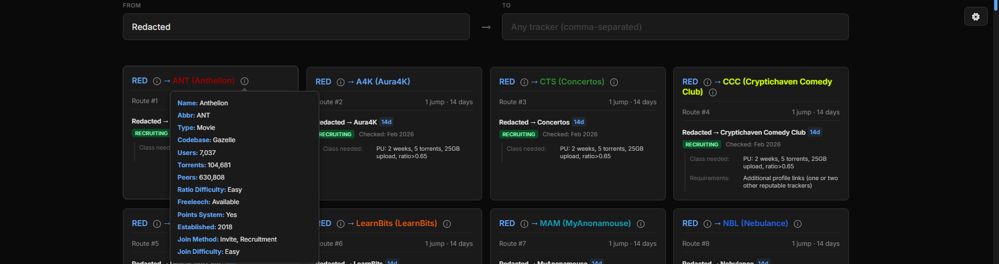

# Private Tracker Route Planner

A fast and efficient route planning tool for private trackers. Find the optimal path between trackers with customizable jump limits and timeframes.

## Features

- **Fast Route Calculation** - Efficiently compute shortest paths between private trackers
- **Flexible Filtering** - Set maximum jump limits and time constraints for personalized results
- **Multiple Sort Options** - Organize results by different criteria to match your needs
- **Route Merging** - Intelligently combine similar routes for cleaner results
- **Custom Themes** - Choose from multiple color schemes including custom color picker
- **Responsive Design** - Works seamlessly on desktop and mobile devices
- **Auto-search** - Quick search with autocomplete for tracker discovery
- **Tracker Type Coloring** - Visual distinction of trackers by type for quick identification
- **Detailed Tooltips** - Hover over trackers to see comprehensive information

## Getting Started

### View the Application

Visit the tool in your browser to start planning routes:

### How to Use

1. **Select Source Tracker** - Enter or search for your starting tracker
2. **Select Target Tracker** - Enter or search for your destination
3. **Adjust Settings** - Configure maximum jumps, days, sort order, and appearance
4. **View Results** - Get optimized routes based on your criteria

### Settings

Customize your experience with available options:

- **Max Jumps** - Limit the number of intermediate hops (0-10)
- **Max Days** - Filter by account age requirements
- **Sort By** - Arrange routes by different metrics
- **Color Scheme** - Choose from preset themes or create a custom color

## Application Interface

The tool provides an intuitive interface with:
- Real-time search autocomplete
- Instant route calculations
- Detailed result displays
- Mobile-friendly layout

## Data Sources

- **Route Data** - Sourced from [handokota/trackerpathways](https://github.com/handokota/trackerpathways)
- **Tracker Information** - Tooltips and details from [HDVinnie/Private-Trackers](https://github.com/HDVinnie/Private-Trackers)

## Technical Details

Built with vanilla JavaScript for optimal performance and minimal dependencies. The route calculation engine efficiently handles complex tracker networks to provide results in seconds.

## About This Project

Originally forked from [invite.icu](https://github.com/invite-icu/invite.icu), this tool evolved into a TrackerPathways alternative to address lag issues. It uses AI-generated content combined with real tracker data to provide a fast and reliable route planning experience.

## Credits

- **invite.icu** - Original project foundation
- **handokota/trackerpathways** - Tracker relationship and route data
- **HDVinnie/Private-Trackers** - Comprehensive tracker information